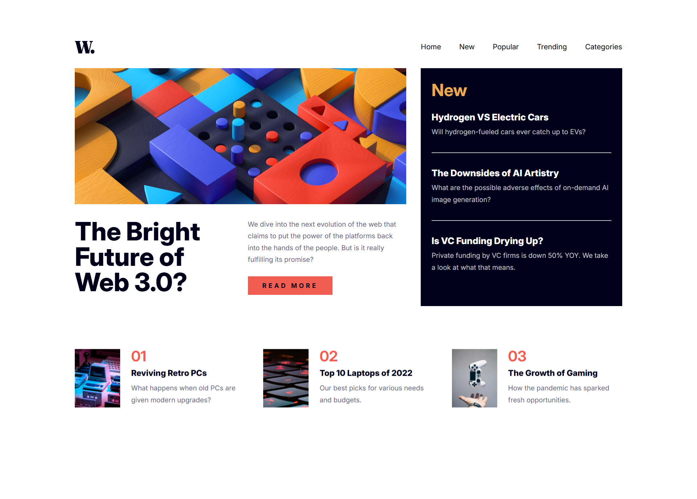

# News Homepage

Esta es una solución al [desafío de News Homepage en Frontend Mentor](https://www.frontendmentor.io/challenges/news-homepage-H6SWTa1MFl). Los desafíos de Frontend Mentor ayudan a mejorar tus habilidades de programación creando proyectos realistas.

## 🔎 Descripción general
Proyecto responsive para resolución mobile (375px), tablet (768px) y desktop (1440px). 

### 📷 Captura de pantalla

### 🔗 Links
- [URL de la solución](https://www.frontendmentor.io/solutions/news-homepage-solution-yPZOAnEdQA)
- [URL del sitio en vivo](https://braismarquez2025.github.io/News-homepage/)

### 🔧 Llevado a cabo con
- HTML
- SCSS
- JavaScript
- GitHub Pages

### ✌️ Autor 
- 💼 GitHub - https://github.com/braismarquez2025
- ✉️ Gmail - braismarquez2003@gmail.com
- 👤 Usuario de Frontend - [@braismarquez2025](https://www.frontendmentor.io/profile/braismarquez2025)

